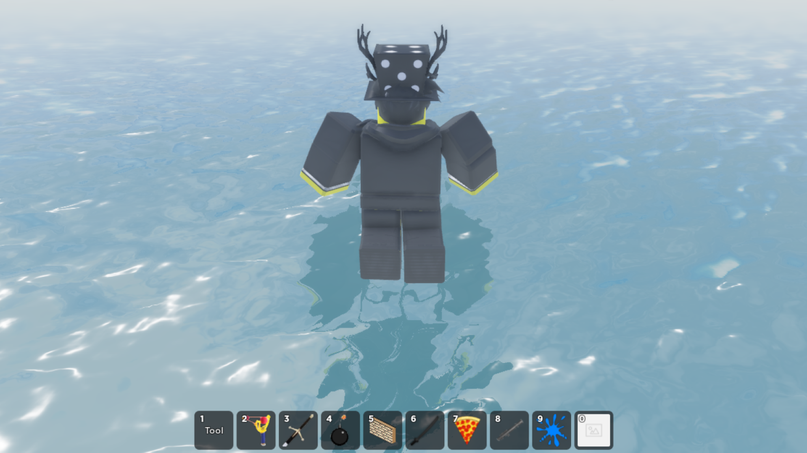
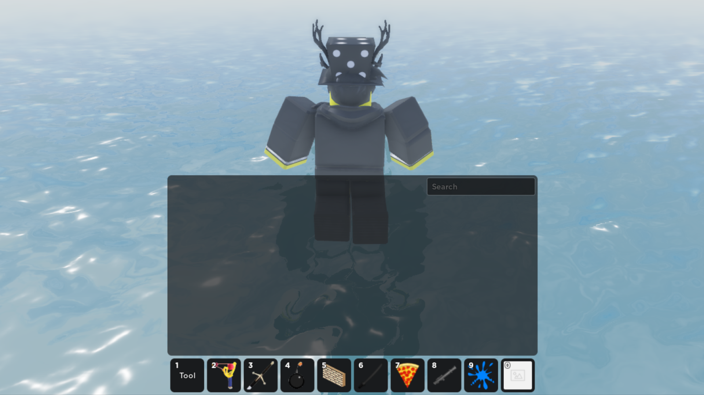
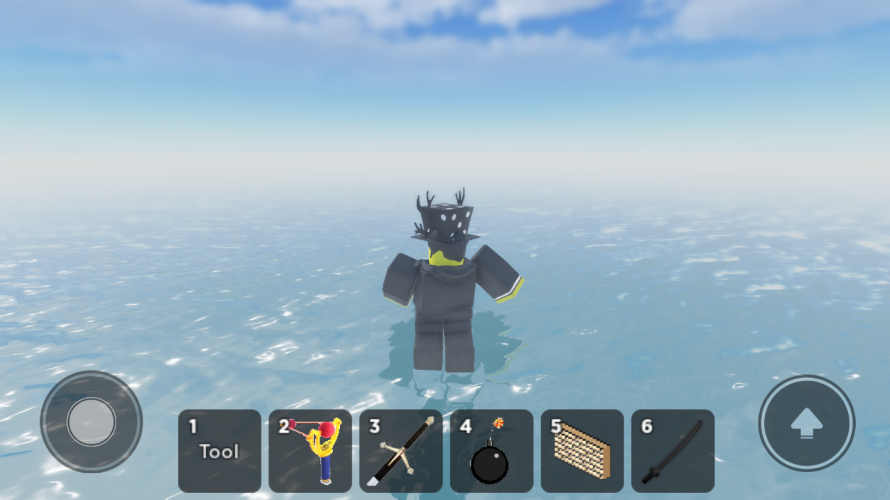
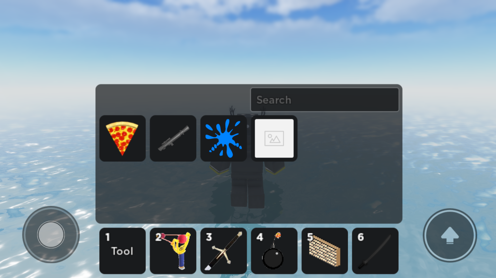

<h1 align="center">
  
   
  Satchel
</h1>

  
  
  
  
  
  

Satchel is a modern open-source alternative to Roblox's default backpack. Satchel aims to be more customizable and easier to use than the default backpack while still having a "vanilla" feel. Installation of Satchel is as simple as dropping the module into your game and setting up a few properties if you like to customize it. It has a familiar feel and structure as to the default backpack for ease of use for both developers and players.

 
 

<https://github.com/RyanLua/Satchel/assets/80087248/2cd3f164-6bf3-4c3b-a682-67a386f576d5>

## 📖 Documentation

See the [documentation site](https://satchel.luau.page) for more about Satchel. Find guides on how to get started, learn about the API, understand what Satchel is, and more.

If you see anything wrong, open a new [documentation issue](https://github.com/RyanLua/Satchel/issues/new?template=documentation_issue.yml).

## ❤️ Sponsors

Special thanks for our sponsors for supporting Satchel and it's future development. We distribute Satchel and provide updates for free, for anyone to use or modify.

 

  <a href="https://www.dobigstudios.com/" target=_blank>
    <picture>
      <source media="(prefers-color-scheme: dark)" srcset="docs/assets/sponsors/do-big-dark.png" height="60">
      <source media="(prefers-color-scheme: light)" srcset="docs/assets/sponsors/do-big-light.png" height="60">
      
    </picture>
  </a>

 

[Become a sponsor](https://github.com/sponsors/RyanLua)

## 🙏 Contributing

We welcome all contributions from the community. See the [contributing guidelines](.github/CONTRIBUTING.md) for details.

## 📃 License

Satchel is available under the Mozilla Public License 2.0 license. See [LICENSE.txt](LICENSE.txt) for details.
