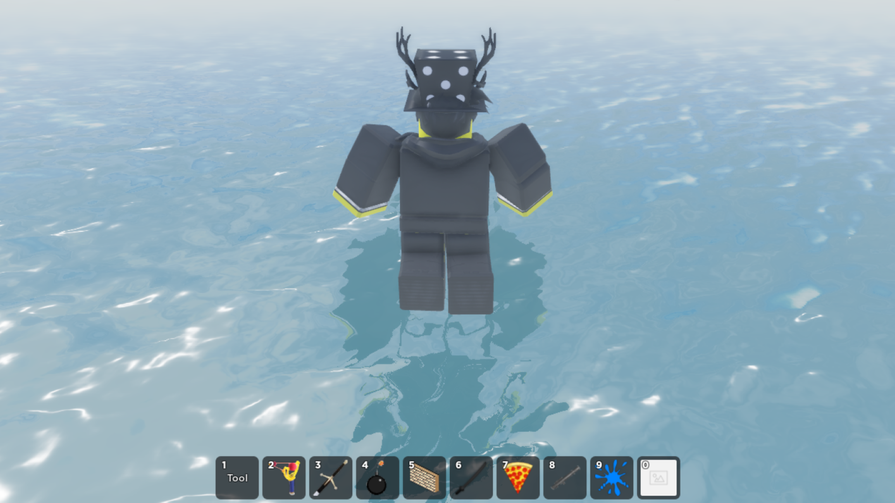
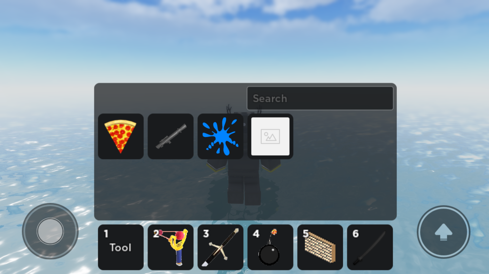
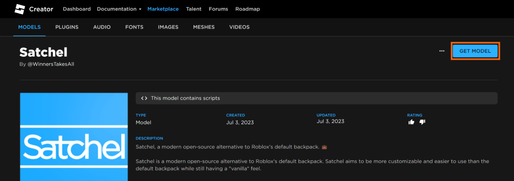
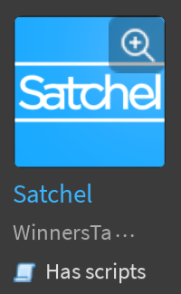
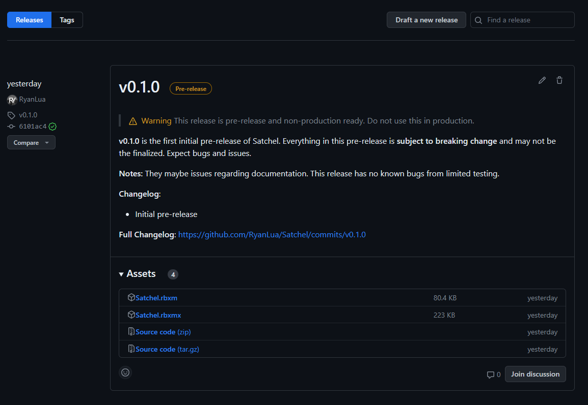
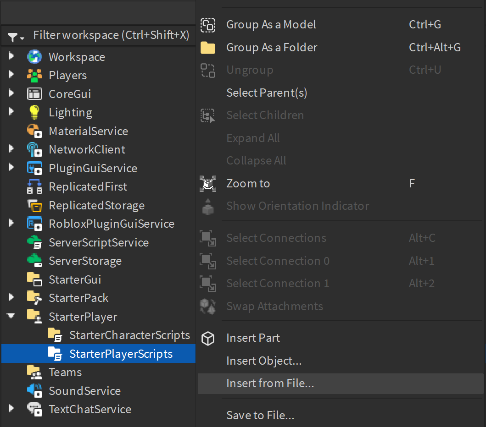
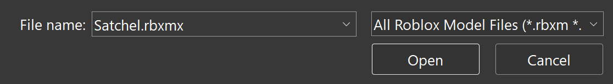

<h1 align="center">
  <picture>
    <source media="(prefers-color-scheme: dark)" srcset="assets/SatchelWhite.png">
    <source media="(prefers-color-scheme: light)" srcset="assets/SatchelBlack.png">
    
  </picture>
  
  
  
  
</h1>

> Satchel, a modern open-source alternative to Roblox's default backpack. 💼

## ℹ️ About

Satchel is a modern open-source alternative to Roblox's default backpack. Satchel aims to be more customizable and easier to use than the default backpack while still having a "vanilla" feel. Installation of Satchel is as simple as dropping the module into your game and setting up a few properties if you like to customize it. It has a familiar feel and structure as to the default backpack for ease of use for both developers and players.

 
 

## ⭐ Features

Satchel comes packed with much needed features and changes which the default backpack doesn't have.

### Modernized Familiar Feel

Satchel completely remakes the backpacks UI to a uniform and vanilla feeling UI, blending in with other elements designed by Roblox.

  

### Highly Customizable & Versitile

Satchel is highly customizable & adjustable with instance attributes support allowing you to customize the behavior and appearance of over 10+ attributes. Change the color, transparency, behavior, and more of it's elegantly designed UI.

  

### Improved Mobile Experiance

Satchel expands on the mobile experiance doubling the amount of slots allowing players on mobile to not be at a disadvantage.

  

### Topbar Plus Support

Satchel supports [Topbar Plus by 1ForeverHD](https://github.com/1ForeverHD/TopbarPlus) to allow users to easily and more quickly open the inventory.

  

## 🛝 Playground

> **Note**
>
> [Satchel Playground](https://www.roblox.com/games/13592168150) has place copying enabled, allowing you to edit your own copy from the Roblox website by clicking the ellipsis (`...`) and selecting `Edit`.

We provide an open-source playground of Satchel where you can test and play with Satchel before deciding to use it. See [Satchel Playground](https://www.roblox.com/games/13592168150) on Roblox. Feel free to use the playground as a reference for how to use Satchel. Please download and modify towards your liking.

## 🔽 Installation

Installation of Satchel is easy and painless. Satchel is a drag-and-drop module that works out of the box and with easy customization. Below are different ways to get you to download and install Satchel.

<h3>Install from Creator Marketplace</h3>

1. Get the Satchel module from the [Creator Marketplace](https://create.roblox.com/marketplace/asset/13947506401).

2. Open Roblox Studio and create a new place or open an existing place.

3. Open or locate the [Toolbox](https://create.roblox.com/docs/studio/toolbox).

4. Open your [Inventory](https://create.roblox.com/docs/studio/toolbox#inventory) from the [Toolbox](https://create.roblox.com/docs/studio/toolbox).

5. Search for `Satchel` created by `WinnersTakesAll` and click on it.

6. Insert `Satchel` into the [Explorer](https://create.roblox.com/docs/studio/explorer) and drag into [StarterPlayerScripts](https://create.roblox.com/docs/reference/engine/classes/StarterPlayerScripts).

<h3>Install from GitHub Releases</h3>

1. Download the `Shime.rbxmx` file from [Releases](https://github.com/RyanLua/Shime/releases).

2. Open Roblox Studio and create a new place or open an existing place.

3. Go to the [Explorer](https://create.roblox.com/docs/studio/explorer) and right click on [`StarterPlayerScripts`](https://create.roblox.com/docs/reference/engine/classes/StarterPlayerScripts) and click on `Insert from file...`.

4. Select the `Satchel.rbxmx` you downloaded from GitHub and click `Open`.

5. Require the Shime module in your script like below when you want to use Shime.

6. Ensure that `Satchel`is in [StarterPlayerScripts](https://create.roblox.com/docs/reference/engine/classes/StarterPlayerScripts).

## 👤 Acknowledgements

A special thanks to the following people for their contributions to Satchel.

| Roblox Username | Contribution |
| --- | --- |
| [@OnlyTwentyCharacters](https://www.roblox.com/users/28969907/profile), [@SolarCrane](https://www.roblox.com/users/29373363/profile) | Creating the original CoreGui script |
| [@thebrickplanetboy](https://www.roblox.com/users/525495863/profile) | Allowing me to republish & modify his fork of the backpack system |
| [@ForeverHD](https://www.roblox.com/users/82347291/profile) | Making Topbar Plus and open-sourcing it for everyone to use |

## 💖 Support

> **Note**
>
> If you see an issue with Satchel and would like to report it, see [SUPPORT.md](SUPPORT.md) for additional information.

Satchel fully supports all platforms which includes computer, tablet, phone, console, and VR.

You can support Satchel by starring this repository, sharing it with others, and contributing to it. Learn about contributing to Satchel below at [Contributing](#contributing).

## 📖 Documentation

Satchel supports instance attributes allowing you to change and customize many aspects including various behaviors in a friendly easy-to-use interface without having to touch any code. Below see all attributes.

### Attributes

| Attribute | Details |
| :--- | :--- |
| BackgroundColor3: [`Color3`](https://create.roblox.com/docs/reference/engine/datatypes/Color3) | Determines the background color of the default inventory window and slots. |
| BackgroundTransparency: [`number`](https://create.roblox.com/docs/scripting/luau/numbers) | Determines the background transparency of the default inventory window and slots. |
| CornerRadius: [`UDim`](https://create.roblox.com/docs/reference/engine/datatypes/UDim) | Determines the radius, in pixels, of the default inventory window and slots. |
| EquipBorderColor3: [`Color3`](https://create.roblox.com/docs/reference/engine/datatypes/Color3) | Determines the color of the equip border when a slot is equipped. |
| EquipBorderSizePixel: [`number`](https://create.roblox.com/docs/scripting/luau/numbers) | Determines the pixel width of the equip border when a slot is equipped. |
| InsetIconPadding: [`boolean`](https://create.roblox.com/docs/scripting/luau/booleans) | Determines whether or not the tool icon is padded in the default inventory window and slots. |
| OutlineEquipBorder: [`boolean`](https://create.roblox.com/docs/scripting/luau/booleans) | Determines whether or not the equip border is outline or inset when a slot is equipped. |
| TextColor3: [`Color3`](https://create.roblox.com/docs/reference/engine/datatypes/Color3) | Determines the color of the text in default inventory window and slots. |
| TextSize: [`number`](https://create.roblox.com/docs/scripting/luau/numbers) | Determines the size of the text in the default inventory window and slots. |
| TextStrokeColor3: [`Color3`](https://create.roblox.com/docs/reference/engine/datatypes/Color3) | Determines the color of the text stroke of text in default inventory window and slots. |
| TextStrokeTransparency: [`number`](https://create.roblox.com/docs/scripting/luau/numbers) | Determines the transparency of the text stroke of text in default chat window and slots. |

<!-- Enums aren't supported by Rojo so this is commented out for now until a fix is available.

| EquipBorderMode: [`BorderMode`](https://create.roblox.com/docs/reference/engine/enums/BorderMode) | Determines in what manner the equip border is laid out relative to its dimensions when a slot is equipped. |
| FontFace: [`Font`](https://create.roblox.com/docs/reference/engine/enums/Font) | Determines the font of the default inventory window and slots. |

-->

## 🙏 Contributing

We welcome all contributions from the community. If you would like to contribute, please see [CONTRIBUTING.md](CONTRIBUTING.md) to get started on how to contribute to Satchel.

When you contribute to Satchel you will be accredited for your contribution for everyone to see on this repository along with supporting the open-source community.

## 📃 License

Shime is licensed under [GNU General Public License v3.0](https://www.gnu.org/licenses/). See [LICENSE.txt](LICENSE.txt) for details.
