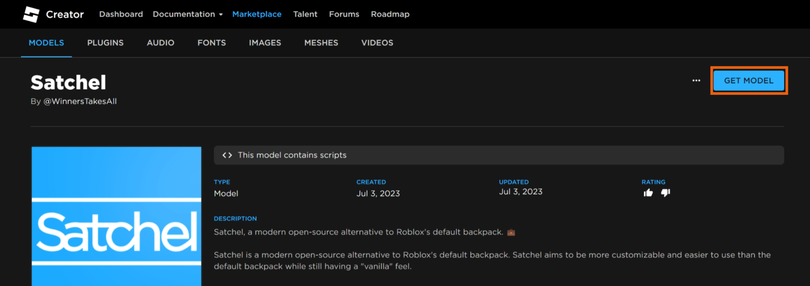
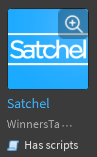
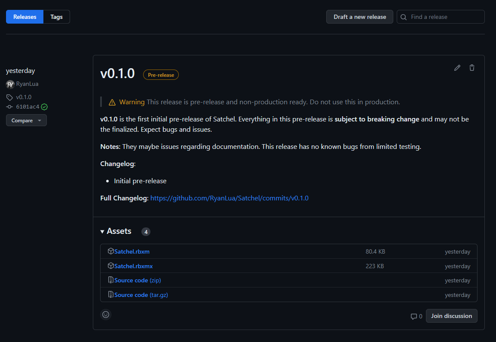

Installing Satchel is easy and painless. Satchel is a drag-and-drop module that works out of the box and with no configuration needed.

Satchel uses [RunContext] to run anywhere, so you do not need to move it from [Workspace], though it is recommeneded to parent to [`ReplicatedStorage`][ReplicatedStorage] for best practices and organizational reasons.

!!! danger

    Do not parent the Satchel to any starter containers or it will run multiple times. Older versions of Satchel required you to do this but it is no longer needed in versions [`v1.4.0`][v1.4.0] and newer.

  [RunContext]: https://devforum.roblox.com/t/1938784
  [Workspace]: https://create.roblox.com/docs/reference/engine/classes/Workspace
  [ReplicatedStorage]: https://create.roblox.com/docs/reference/engine/classes/ReplicatedStorage
  [v1.4.0]: https://github.com/RyanLua/Satchel/releases/tag/v1.4.0

## Creator Store <small>recommended</small> { #creator-store data-toc-label="Creator Store" }

The Creator Store is the easiest way to install Satchel. It is a one-click installation and requires no downloads.

???+ example

    Below is a video on how to install Satchel from the Creator Store.

    <div style="position:relative;padding-top:56.25%;">
      <iframe width=100% height=100% src="https://www.youtube-nocookie.com/embed/dRrzQKBLAx0?si=-iPs0s5LgM6VR323" frameborder="0" allow="accelerometer; autoplay; clipboard-write; encrypted-media; gyroscope; picture-in-picture; web-share" referrerpolicy="strict-origin-when-cross-origin" allowfullscreen style="position:absolute;top:0;"></iframe>
    </div>

1. Get the **Satchel** model from the [Creator Store].

    { width="100%" }

1. Open Roblox Studio and create a new place or open an existing place.

1. From the [View] tab, open the [Toolbox] and select the **Inventory** tab.

    

    

1. Locate the **Satchel** model and click it, or drag-and-drop it into the 3D view.

    

1. In the [Explorer] window, move the **Satchel** model into [`ReplicatedStorage`][ReplicatedStorage].

  [Creator Store]: https://create.roblox.com/store/asset/13947506401
  [View]: https://create.roblox.com/docs/studio/view-tab
  [Toolbox]: https://create.roblox.com/docs/projects/assets/toolbox
  [Explorer]: https://create.roblox.com/docs/studio/explorer

## GitHub Releases

1. Download the `Satchel.rbxm` or `Satchel.rbxmx` model file from [GitHub Releases].

    !!! info

        Binary (`.rbxm`) and XML (`.rbxmx`) model files contain the exact same model. `.rbxm` is a smaller file size to download.

    

1. Open Roblox Studio and create a new place or open an existing place.

1. In the [Explorer] window, insert **Satchel** into [`ReplicatedStorage`][ReplicatedStorage].

    { width="50%" }

1. Select the **Satchel** model file you downloaded from GitHub.

  [GitHub Releases]: https://github.com/RyanLua/Satchel/releases

## Wally

You are expected to already have Wally setup in your Rojo project and basic knowledge on how to use Wally packages.

!!! warning

    Wally does not include the loader script so you need to [`#!lua require()`][require] Satchel to run:
    ``` lua title="Satchel Loader"
    require(script.Satchel)
    ```

1. Open your Rojo project in the code editor of your choice.

1. In the `wally.toml` file, add the [latest Wally version for Satchel][Wally]. Your dependencies should look similar to this:

    ``` toml title="wally.toml"
    [dependencies]
    satchel = "ryanlua/satchel@1.0.0"
    ```

1. Install Satchel from Wally by running `wally install`.

  [Wally]: https://wally.run/package/ryanlua/satchel
  [require]: https://create.roblox.com/docs/reference/engine/globals/LuaGlobals#require
