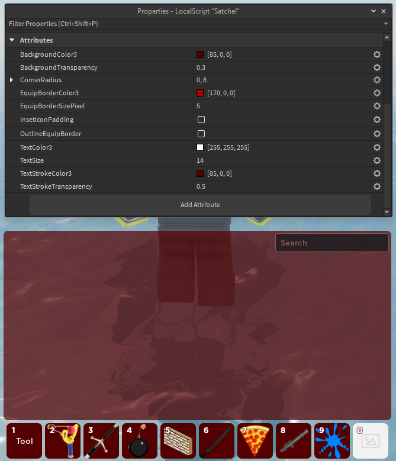

Use of Satchel after installation very easy. Just [publish your experience to Roblox] and see Satchel live in action.

To learn how to install Satchel, see [Installation].

!!! note

    Please see [API Reference] for more details on attributes, methods, and events for Satchel and how to use Satchel to it's full potential.

  [publish your experience to Roblox]: https://create.roblox.com/docs/production/publishing
  [Installation]: installation.md
  [API Reference]: api-reference.md

### Customization

Satchel is highly customizable & adjustable with [instance attributes] support allowing you to customize the behavior and appearance of over 10+ attributes.

Some of the attributes include:

* Text Color, Size, Stroke Color & Transparency
* Background Color & Transparency
* Equip Border Color & Thickness
* Corner Radius
* Font

More attributes can be found in the [API Reference]. The list above is not exhaustive and there are may more attributes available for customization.

  [instance attributes]: https://create.roblox.com/docs/studio/instance-attributes

<figure markdown>
  
  <figcaption>Example of customization using instance attributes</figcaption>
</figure>

### Scripting

Satchel offers methods and events for scripting purposes. In the below code example we will use the `SetBackpackEnabled` method to disable the Satchel. The script expects the Satchel module to be in [`ReplicatedStorage`][ReplicatedStorage].

``` lua title="Disable Backpack"
local ReplicatedStorage = game:GetService("ReplicatedStorage")

local Satchel = require(ReplicatedStorage.Satchel)

Satchel.SetBackpackEnabled(false)
```

For the full API reference, see [API Reference] for more details on attributes, methods, and events for Satchel and how to use Satchel to it's full potential.

  [ReplicatedStorage]: https://create.roblox.com/docs/reference/engine/classes/ReplicatedStorage
  [SetBackpackEnabled]: api-reference.md#setbackpackenabled
