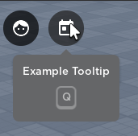

# UIShelf

UIShelf is a new built-in library that allows you to create top bar icons similar to the famous [Topbar Plus](https://devforum.roblox.com/t/topbarplus-v291-construct-intuitive-topbar-icons-customise-them-with-themes-dropdowns-captions-labels-and-much-more/1017485), but in a more simple way. There's no complex features or anything, all it does is mimic the topbar icons 1:1 and thats it. Though it also has some extra features like the ability to bind keycodes to activate it.

### Creating an Icon

Creating an icon is rather simple, all it requires is the following 4 arguments wrapped in a table:

When inputting these into your table, they must be in correct order or the code will malfunction. The image can either be an id or a direct URI. The order is basically just the layout order, and will be correctly accomodated for depending on if it was placed on the left/right. The `Area` element decides which side the icon is on, `1` is the left side, while `2` is the right side. You can also use `UIShelf.HorizontalAlignment` if it's easier to remember.

If you're confused, here is an example of it layed out:

```lua
local Icon = UIShelf.CreateIcon({
	Name = "MyFavoriteIcon",
	Image = "rbxassetid://12515281752",
	Order = 1,
	Area = UIShelf.HorizontalAlignment.Left,
})
```

This will create a new and basic topbar icon on the left side of the screen, with an order of `1`.

### Respond to Input

To respond to input of almost any type, you can use the `TopBarIcon.Activated` event. This event will fire every time the icon is clicked, whether that be by a mouse, keycode, touch tap, or gamepad, it will fire. This also has a [`Enum.UserInputType`](https://create.roblox.com/docs/reference/engine/enums/UserInputType) argument indicating which input type fired the event. Here's an example below, nothing special.

```lua
Icon.Activated:Connect(function(inputType) 
	print(inputType) -- Output: Enum.UserInputType.MouseButton1
end)
```
### Add Notices

Since the chat icon in the topbar has notices when the player hasn't opened their chat, so do UIShelf icons. These notices are created 1:1 with the original and by default have a notice cap of 99. This means when 100 notices is hit, the display will turn into 99+ instead of 100. Notifications aren't technically 'capped', rather just a display cap.

The API to add notices takes two parameters;

1. The amount of notices to add, leaving nil is 1
2. The notice cap, leaving nil is 99

Here's an example of a single notice being added when the icon is clicked:

```lua
local Icon = UIShelf.CreateIcon({
	Name = "MyFavoriteIcon",
	Image = "rbxassetid://12515281752",
	Order = 1,
	Area = UIShelf.HorizontalAlignment.Left,
})

Icon.Activated:Connect(function() 
	Icon:SetIconNotices(1, nil) -- Prefered to leave nil if you don't need to change the limit. This cuts down on string interpolation since the result is cached
end)
```

This will have the desired effect of adding a notice once per click/activation.

### Spacers

A UIShelf spacer object is what it is says it is: *it's a spacer.* This allows you to create spacers for other topbar items, such as an HD Admin topbar item. Please keep in mind that spacers and icons are mixed, so it's important to account for different orders.

An example spacer, requires no other functions to run:

```lua
local Spacer = UIShelf.CreateSpacer({
	Name = "MySpacer",
	Order = 1,
	Area = 1,
}) -- Same format as CreateIcon, just doesn't have image URI/ID element
```

### Tooltips

Tooltips are simple popups that display below the icon when they are hovered over. Here is how you would set a tooltip for any icon:

```lua
local Icon = UIShelf.CreateIcon({
	Name = "MyFavoriteIcon",
	Image = "rbxassetid://12515281752",
	Order = 1,
	Area = UIShelf.HorizontalAlignment.Left,
})

Icon:SetTooltip("Example Tooltip") -- Sets the label of the tooltip also while creating it
```

UIShelf tooltips also have a feature where if you have a tooltip *and* a bound keycode, the tooltip will also display the key below the text: 

```lua
local Icon = UIShelf.CreateIcon({
	Name = "MyFavoriteIcon",
	Image = "rbxassetid://12515281752",
	Order = 1,
	Area = UIShelf.HorizontalAlignment.Left,
})

Icon:BindKeyCode(Enum.KeyCode.Q)
Icon:SetTooltip("Example Tooltip") -- Sets the label of the tooltip also while creating it
```

Here is it what it looks like:


